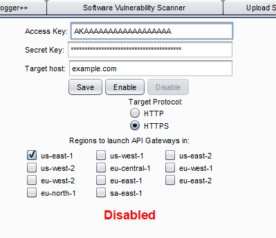
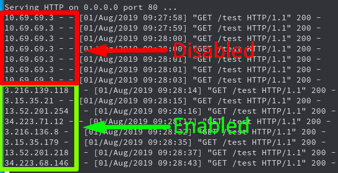

# IPRotator_Burp_Extension
Extension for Burp Suite which uses AWS API Gateway to rotate your IP on every request.

## Description
This extension allows you to easily spin up API Gateways across multiple regions. All the Burp Suite traffic for the targeted host is then routed through the API Gateway endpoints which causes the IP to be different on each request. (There is a chance for recycling of IPs but this is pretty low and the more regions you use the less of a chance.)

This is useful to bypass IP blocking defense like bruteforce protection that blocks based on IP, API rate limiting based on IP or WAF blocking based on IP etc.

## Usage
1) Ensure you have a set of AWS keys that have full access to the API Gateway service.  
2) Insert the credentials into the fields.  
3) Insert the target domain you wish to target.  
4) Select HTTPS if the domain is hosted over HTTPS.  
5) Select all the regions you want to use.(The more you use the larger the IP pool will be)  
6) Click "Enable".
7) Once you are done ensure you click disable to delete all the resources which were started.

If you want to check on the resources and enpoints that were started you can look at the output console in Burp.

