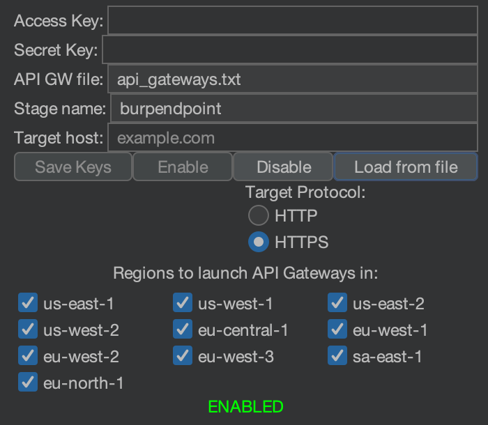
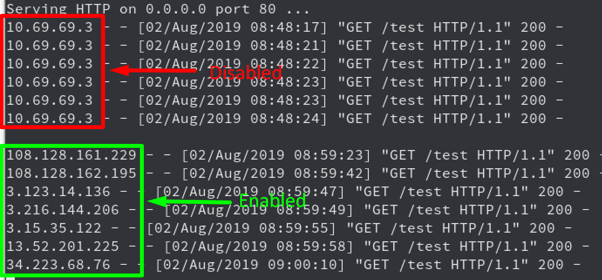
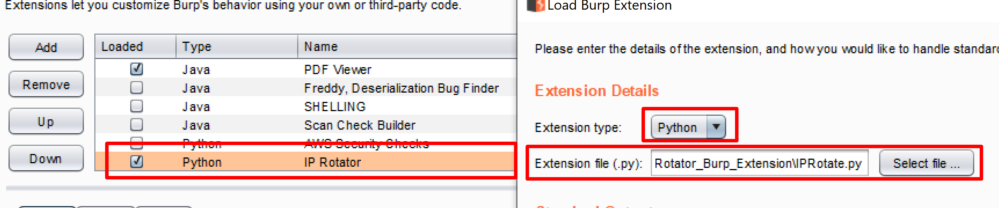

# IPRotate_Burp_Extension

Extension for Burp Suite which uses AWS API Gateway to change your IP on every request.

More info: [Bypassing IP Based Blocking Using AWS - Rhino Security Labs](https://rhinosecuritylabs.com/aws/bypassing-ip-based-blocking-aws/)

## Description

This extension allows you to easily spin up API Gateways across multiple regions. All the Burp Suite traffic for the targeted host is then routed through the API Gateway endpoints which causes the IP to be different on each request. (There is a chance for recycling of IPs but this is pretty low and the more regions you use the less of a chance).

This is useful to bypass different kinds of IP blocking like bruteforce protection that blocks based on IP, API rate limiting based on IP or WAF blocking based on IP etc.

## Usage

1. Setup [Jython](https://www.jython.org/download.html) in Burp Suite.
2. Install the [boto3](https://github.com/boto/boto3) module for Python 2.
   1. Make sure that you setup your [python environment in burp](https://portswigger.net/burp/documentation/desktop/tools/extender#python-environment) to load the [boto3](https://github.com/boto/boto3) module properly or it won't find it.
3. Ensure you have a set of AWS keys that have full access to the API Gateway service. This is available through the free tier of AWS.
4. Insert the credentials into the fields.
5. Insert the target domain you wish to target.
6. Select HTTPS if the domain is hosted over HTTPS.
7. Select all the regions you want to use.(The more you use the larger the IP pool will be)
8. Click "Enable".
9. Once you are done ensure you click disable to delete all the resources which were started.

If you want to check on the resources and enpoints that were started or any potential errors you can look at the output console in Burp.

### The Burp UI

### Example of how the requests look

### Setup

Make sure you have Jython installed and add IPRotate.py through the Burp Extension options.

## Previous Research

After releasing this extension it was pointed out that there has been other research in this area using AWS API Gateway to hide an IP address. There is some awesome research and tools by [@ustayready](https://twitter.com/ustayready) [@ryHanson](https://twitter.com/ryHanson) and [@rmikehodges](https://twitter.com/rmikehodges) using this technique.

Be sure to check them out too:

- [fireprox](https://github.com/ustayready/fireprox)
- [hideNsneak](https://github.com/rmikehodges/hideNsneak)
